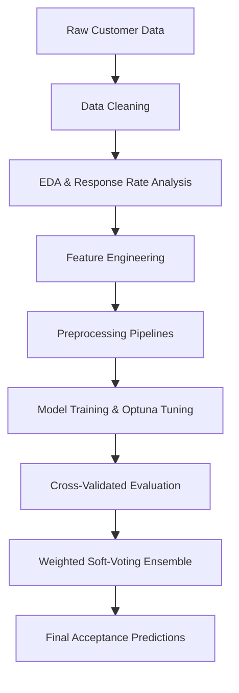
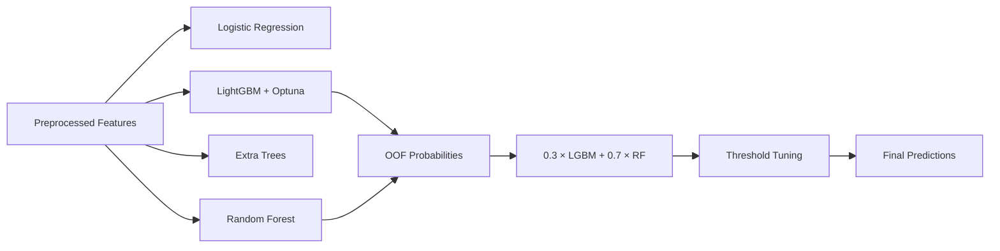

# Customer Response Prediction


---

## Overview

This project builds machine learning models that predict whether a customer will accept a marketing offer, using a mix of demographic, contact-history, and macroeconomic features.

The workflow includes:
- Exploratory data analysis on categorical response signals
- Numerical and categorical preprocessing pipelines
- Manual feature engineering for engagement, financial-risk, and macroeconomic flags
- Tuned model comparison across linear, tree-based, and boosted families
- Out-of-fold weighted soft-voting ensemble
- Feature importance interpretation

The project demonstrates how gradient-boosting models, paired with hand-crafted features, can be applied to imbalanced structured tabular data for binary classification problems.

---

## Project Workflow



---

# Business Problem

Marketing teams need to prioritize the customers most likely to respond to an offer so that campaign budget is spent on high-probability prospects rather than uniform outreach.

Accurate customer-response models can support:
- Campaign targeting and budget allocation
- Lift analysis versus untargeted baselines
- Channel and timing optimization
- Customer-segmentation studies
- Cost-of-contact versus conversion modeling

This project predicts whether a customer will accept a marketing offer using demographic, contact, and macroeconomic features.

---

# Dataset

The project uses a customer-marketing dataset (32,950 training rows, 8,238 test rows) containing:

- Customer demographics (`customer_age`, `occupation_type`, `relationship_status`, `education_background`)
- Financial indicators (`has_credit_issue`, `mortgage_status`, `personal_loan_status`)
- Contact details (`last_contact_month`, `day_of_week`, `contact_time_minutes`, `contact_attempt_count`)
- Engagement history (`days_since_prior_contact`, `prior_contact_count`, `prior_outcome_status`)
- Macroeconomic indicators (`economic_activity_change`, `consumer_price_index`, `consumer_confidence_index`, `reference_interest_rate`, `employment_level_index`)
- Helper flags (`is_repeat_customer`, `recent_contact_flag`)
- Target column

### Target Variable
- `accepted_offer` — `1` if the customer accepted the offer, `0` otherwise

This is a binary classification problem with strong class imbalance (~88.7% class 0, ~11.3% class 1).

---

# Exploratory Data Analysis (EDA)

### Key Insights
- Customers whose previous marketing contact was a success accept the new offer roughly **64%** of the time, versus around **9–14%** for "nonexistent" or "failure" histories — the single strongest categorical signal in the data
- Acceptance rates are nearly an order of magnitude higher in March, December, September, and October than in the high-volume May contact window
- Accepted offers were consistently associated with longer conversations — the accepted-offer median for `contact_time_minutes` sits well above the declined-offer upper quartile
- The dataset shows moderate class imbalance toward the declined-offer class

### Prior Outcome Drives Acceptance


### Timing Matters


### Engagement Length Separates Classes


---

# Data Preprocessing

The preprocessing workflow includes:

- Missing value handling
- One-hot encoding for nominal categorical variables
- Power transformation (Yeo-Johnson) for skewed numeric features used by Logistic Regression
- Passthrough numeric features for the tree-based models
- Stratified train/test splitting
- Removal of three correlated features (`employment_level_index`, `economic_activity_change`, `id`) before modeling

### Pipeline Components
- `ColumnTransformer`
- `OneHotEncoder`
- `PowerTransformer(method="yeo-johnson")`
- `Pipeline`

The preprocessing pipeline ensures reproducibility and consistent model input formatting across all candidate models.

---

# Feature Engineering

The notebook derives a set of engagement, financial-risk, and macroeconomic flags on top of the raw columns:

| Engineered Feature | Definition |
| --- | --- |
| `contactmin_tocount` | `contact_time_minutes / contact_attempt_count` (with safe divide) |
| `prior_success_flag` | `1` if `prior_outcome_status == "success"` |
| `prior_failure_flag` | `1` if `prior_outcome_status == "failure"` |
| `financial_risk_flag` | `1` if `has_credit_issue == "yes"` or `personal_loan_status == "yes"` |
| `high_engagement` | `1` if `contact_time_minutes` exceeds the median |
| `high_contact_pressure` | `1` if `contact_attempt_count` exceeds the median |
| `contact_month_num` | numeric month mapping for `last_contact_month` |
| `economic_pressures` | `reference_interest_rate − consumer_confidence_index` |
| `macro_pressure` | `reference_interest_rate + consumer_price_index − consumer_confidence_index` |
| `repeat_success_customer` | `1` if customer is a repeat customer AND prior outcome was success |

---

# Modeling Approach

The notebook compares several model families and ends with a weighted soft-voting ensemble of the two strongest learners.



### Training Configuration
- Cross-Validation: Stratified 5-fold
- Class Weighting: `balanced` (applied across LightGBM, Logistic Regression, Random Forest, Extra Trees)
- Hyperparameter Tuning: Optuna (50 trials, F1 objective)
- Ensemble: weighted soft-voting (30% LightGBM + 70% Random Forest probabilities) with threshold tuning

---

# Model Performance

The strongest models emphasized recall for customers likely to accept an offer, which is useful when the cost of missing a likely responder is higher than the cost of contacting some lower-probability customers.

### Evaluation Metrics
- Accuracy
- Positive-class Precision
- Positive-class Recall
- Positive-class F1
- `classification_report` (precision / recall / F1 per class)

### Reported Results

| Model | Accuracy | Positive-Class Recall | Positive-Class F1 |
| --- | ---: | ---: | ---: |
| LightGBM | 0.89 | 0.86 | 0.65 |
| Logistic Regression | 0.86 | 0.89 | 0.59 |
| Random Forest | 0.91 | 0.47 | 0.55 |
| Extra Trees | 0.82 | 0.92 | 0.54 |
| LightGBM + Random Forest Ensemble | 0.90 | 0.80 | 0.65 |

### Key Findings
- LightGBM produced the strongest accuracy-recall-F1 balance among the standalone models
- Random Forest had the highest accuracy but the lowest positive-class recall — it under-predicted acceptances
- Extra Trees recovered the most positive cases at the cost of overall accuracy
- The weighted soft-voting ensemble matched LightGBM's F1 while smoothing out per-fold variance and reducing false positives

### What the Final LightGBM Model Learned

The top-25 LightGBM importances confirm the EDA story: contact length, the reference interest rate, customer age, and the contact attempt count carry the bulk of the predictive weight, followed by day-of-week and month indicators.


---

# Model Interpretation

The model demonstrates how gradient boosting on engineered tabular features, combined with a small soft-voting ensemble, can be applied to imbalanced marketing-response prediction.

Potential applications include:
- Lead-scoring and call-list prioritization
- Campaign A/B-test uplift estimation
- Channel and timing optimization
- Macroeconomic-aware response forecasting
- Cost-sensitive contact-policy design

---

# Technologies Used

- Python
- pandas
- NumPy
- scikit-learn
- LightGBM
- Optuna
- matplotlib
- seaborn
- sweetviz
- Jupyter Notebook

---

# Repository Structure

```text
customer-response-prediction/
│
├── Predicting_CustomerResponse.ipynb
├── images/
│   ├── acceptance-by-prior-outcome.png
│   ├── acceptance-by-contact-month.png
│   ├── contact-time-by-offer.png
│   └── lgbm-feature-importance.png
└── README.md
```

---

# How to Run

1. Clone the repository
2. Install required dependencies
3. Place the training and test CSV files in an accessible location and update the `pd.read_csv(...)` paths in the notebook
4. Open the notebook in Jupyter Notebook or Google Colab
5. Run all notebook cells sequentially

```bash
pip install pandas numpy matplotlib seaborn sweetviz scikit-learn lightgbm optuna
```

---

# Future Improvements

- Store dataset paths in a configuration cell instead of absolute paths
- Add a `requirements.txt` file for reproducible setup
- Add probability-threshold tuning to compare marketing cost versus conversion lift
- Export model-comparison results to CSV
- Package the final model pipeline for deployment or batch scoring

---

# Author

**Pranika Chandra**  
Projects focused on machine learning, predictive analytics, customer-response modeling, and applied data science.
